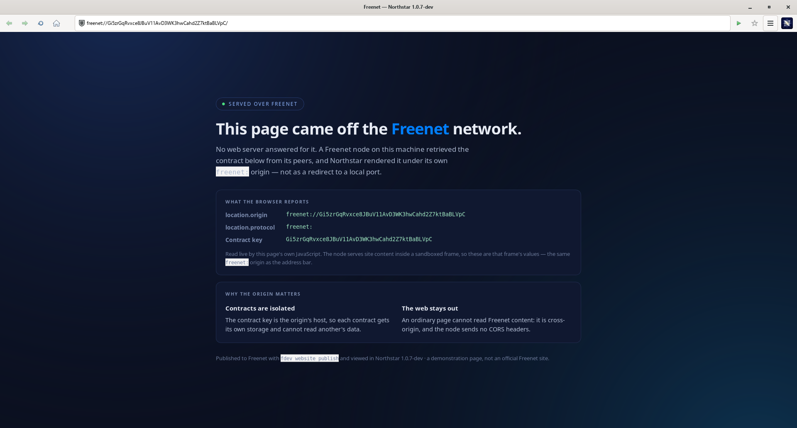

# Northstar web browser — with Freenet support



Northstar is a minimalist web browser written from scratch in C, and it
speaks two networks. It browses the web, and it browses
[Freenet](https://freenet.org/) — the peer-to-peer application platform —
as a first-class URL scheme rather than through a bookmark to a local
port.

Its engine targets practical HTML5, modern CSS and JavaScript
compatibility without embedding Gecko, WebKit, Blink or another browser
engine. Linux is the primary platform; macOS and Windows are also
supported.

This repository is the open-source GPL edition of the
[Nordstjernen project](https://github.com/nordstjernen-web/nordstjernen).
Northstar is licensed under the GNU General Public License, version 3 or
later.


**Freenet:** `freenet://<contract-key>/` is typed, linked, bookmarked and
restored like any other address, and each contract key is its own origin.
See [Freenet](#freenet) below and
[docs/freenet.md](docs/freenet.md).

**Web standards:** Behaviour is measured against the specification text,
section by section, not against another browser. The engine runs
web-platform-tests through headless mode; see
[docs/compliance.md](docs/compliance.md) for the current per-area scores
and the known structural gaps.

**Security:** on Linux the browser runs behind a Landlock filesystem
sandbox (plus `PR_SET_NO_NEW_PRIVS`), with a default-deny seccomp syscall
filter in both GUI and headless/tooling modes · no JIT.
See [SECURITY.md](SECURITY.md) for the exact per-mode posture.

**Minimalism:** one window, one page, one process. The engine is a
compact body of C — about 149,000 lines of original C (excluding the
vendored WAMR, Wuffs and audio decoders, and the generated image-data
tables) — small enough for one person to read and audit end-to-end.

## Freenet

Freenet is a network of peers holding signed, content-addressed
**contracts**. A contract's key is permanent — publishing new content
under it does not change the address — and a contract whose state is an
archive of HTML, CSS and JavaScript is a website. Reaching the network
needs a Freenet node running on your machine; Northstar is a client of
that node, and finds it at `127.0.0.1:7509` by default.

```sh
# with a node running (see freenet.org)
northstar "freenet://Gi5zrGqRvxce8JBuV11AvD3WK3hwCahd2Z7ktBaBLVpC/"
```

The address bar keeps the `freenet:` URL; only the transfer itself is
addressed to the node. That is what makes each contract key a real
origin, and it buys three things:

- **Contracts are isolated from each other.** `localStorage`, IndexedDB
  and the cache are keyed per contract, and one contract cannot `fetch`
  another's data. Point a conventional browser at the node's gateway
  instead and every contract shares one `http://127.0.0.1:7509` origin.
- **The web stays out.** A page on `https://example.com` cannot read
  Freenet content — it is cross-origin, and the node sends no CORS
  headers.
- **Applications work unmodified.** Links written the way the Freenet
  documentation asks — absolute against `/v1/contract/web/<key>/` —
  collapse to the address they name, and a contract's own JavaScript
  opens the node's client API at `/v1/contract/command` exactly as it
  would on the gateway.

The screenshot above is a site published with `fdev website publish` and
served by a local node joined to the live network. The gateway address is
configurable (`freenet_gateway`, `NS_FREENET_GATEWAY`, or **Settings →
General**) and accepts an `https://` gateway as well as loopback.

The older `freenet:USK@…` network, now called Hyphanet, is a different
project and is not supported.

## What this edition is

This edition strips Northstar down to a single-window, single-page,
single-process desktop browser, based on the
[Nordstjernen project](https://github.com/nordstjernen-web/nordstjernen).
It deliberately omits tabs, per-tab renderer processes, WebGL, WebGPU,
an embedded PDF viewer and AI-style web APIs. It does not send telemetry
or update pings.

Audio still plays in-process (MP3, MP2, Ogg Opus/Vorbis). Images decode
in-tree (PNG/APNG, GIF, BMP, JPEG and WebP via Wuffs, AVIF through
libavif when available, and SVG in the engine).

## Browser features

- **HTML** parsed to a DOM by lexbor; **CSS** by the engine's own
  cascade — flex, grid, transforms, gradients, `@keyframes`.
- **JavaScript** on the QuickJS interpreter — DOM, Shadow DOM, observer
  APIs, Canvas 2D (`Path2D`, `ImageBitmap`, `DOMMatrix`), WebCrypto
  (`crypto.subtle` over OpenSSL).
- **Custom elements** — autonomous and customized built-in elements.
- **Workers** — dedicated workers with structured-clone messaging,
  message channels and broadcast channels.
- **Storage** — IndexedDB over SQLite, `localStorage`/`sessionStorage`
  and the cache API, each partitioned by origin.
- **Live connections** — WebSockets and server-sent events.
- **Navigation API** — `window.navigation` for single-page routing.
- **Service workers** — origin-scoped registration, persistence and
  controlled-page fetch interception.
- **WebExtensions** — installed local extensions with manifest content
  scripts, safe packaged resources, local storage and runtime messaging.
- **Networking** over HTTP/2 with libcurl — HTTP/3 when the linked
  libcurl provides it — HSTS, CSP, subresource-integrity (SRI) checks,
  partitioned cookies.
- **Freenet** — the `freenet:` scheme, served by a local node, with each
  contract key its own origin. See [Freenet](#freenet).
- **Safe browsing** — before a top-level navigation is fetched, its host
  is checked against a local SHA-256 blocklist. The check runs entirely
  on-device.
- **Media** — images (PNG/APNG, GIF, BMP, JPEG, WebP, optional AVIF,
  SVG); audio (`<audio>`) decodes and plays in the browser process,
  alongside a Web Audio graph.
  `<video>` plays MPEG-1 (`video/mpeg`), decoded in-tree by the same
  pl_mpeg that already handles MP2 audio. MPEG-1 is an ISO standard whose
  patents have expired, so it costs no dependency and no licence; it is
  also not a format the modern web serves, so this is video support for
  local and self-hosted clips rather than for streaming sites.
- **MathML** — a minimalist presentation-MathML renderer.
- **Spell checking** — optional, via the Enchant library.
- **WebAssembly** — the JavaScript API over a vendored WAMR interpreter.
- **Single window / single process** — the browser shows one page in one
  window, and the page engine runs in the shell process (no per-tab
  renderer processes).
- **UI** — bookmarks, find-in-page, save-to-PDF, JS console, settings,
  headless mode.

## Build and run

On Debian or Ubuntu, install the required development packages:

```sh
sudo apt install build-essential pkg-config meson ninja-build cmake \
    libgtk-4-dev libcurl4-openssl-dev libssl-dev libuchardet-dev \
    libharfbuzz-dev libfribidi-dev libcairo2-dev libfontconfig-dev \
    libfreetype-dev libpsl-dev libsqlite3-dev libseccomp-dev libsdl2-dev \
    zlib1g-dev
meson setup builddir
meson compile -C builddir
./builddir/src/gtk/northstar
```

The development helper configures the default build directory when
needed and runs the same compile command:

```sh
./scripts/dev.sh build
./scripts/dev.sh smoke
```

The smoke command renders deterministic local fixtures through the
headless engine and compares them with the checked-in baselines. A
single page can also be rendered directly:

```sh
./builddir/src/gtk/northstar --headless --dump=text about:start
```

Meson feature options include `-Davif=disabled`, `-Daudio=disabled`,
`-Dwasm=disabled` and `-Dgtk=disabled` for smaller or engine-only builds.

Freenet needs no build option and no extra library — the scheme is part
of the browser. It needs a running node, which is installed separately
from [freenet.org](https://freenet.org/).

WAMR, Wuffs, pl_mpeg and minimp3 are vendored in-tree. lexbor and
quickjs-ng are fetched by `meson setup` as pinned upstream subprojects
(see `subprojects/*.wrap`).

## Dependencies

Northstar's engine is written from scratch — it contains no forked
browser engine (no Gecko, WebKit, or Blink). It is the GPL edition of the
[Nordstjernen project](https://github.com/nordstjernen-web/nordstjernen).

**Fetched at `meson setup`** (pinned upstream meson subprojects, `subprojects/*.wrap`):

| Component | Role |
|-----------|------|
| [lexbor](https://github.com/lexbor/lexbor) v3.0.0 | HTML5 → DOM parser and the WHATWG URL module |
| [quickjs-ng](https://github.com/quickjs-ng/quickjs) v0.15.1 | JavaScript engine — no JIT |
| [ns-pango](https://github.com/nordstjernen-web/ns-pango) | Text itemization, shaping and line breaking — a Pango fork with a cross-layout shaping cache |

**Vendored in-tree** (built from the main tree, no submodules):

| Component | Role |
|-----------|------|
| [WAMR](https://github.com/bytecodealliance/wasm-micro-runtime) (subset) | WebAssembly interpreter |
| [Wuffs](https://github.com/google/wuffs) v0.4 | Memory-safe image decoding — PNG/APNG, GIF, BMP, JPEG, WebP |
| [pl_mpeg](https://github.com/phoboslab/pl_mpeg) (MIT) | In-process MPEG-1 video and MP2 audio decode |
| [minimp3](https://github.com/lieff/minimp3) (CC0) | In-process MP3 audio decode |

**Required system libraries:** GTK 4 (≥ 4.14; ≥ 4.22.1 on Windows),
GLib/Cairo, HarfBuzz, FriBidi, fontconfig, FreeType, libcurl (≥ 8.5),
OpenSSL (libcrypto), uchardet, libpsl, SQLite and zlib. The engine lays
text out through ns-pango rather than the system Pango; GTK still links
the system Pango for its own widgets, and the two coexist because every
symbol in the fork is renamed. Linux builds also require libseccomp. SDL2 is
required when in-process audio is enabled.

**Optional** (auto-detected): libavif (AVIF images), opusfile /
vorbisfile (in-process Ogg audio), Enchant (spell-checking) and libthai
(Thai line breaking).

## License

Northstar is free software, licensed under the **GNU General Public
License, version 3 or later** — see [LICENSE](LICENSE).

Project home: <https://nordstjernen.org> · Copyright 2026 Andreas Røsdal.

## Builds
[](https://github.com/nordstjernen-web/northstar-browser/actions/workflows/linux.yml)
[](https://github.com/nordstjernen-web/northstar-browser/actions/workflows/musl.yml)
[](https://github.com/nordstjernen-web/northstar-browser/actions/workflows/macos.yml)
[](https://github.com/nordstjernen-web/northstar-browser/actions/workflows/windows.yml)
